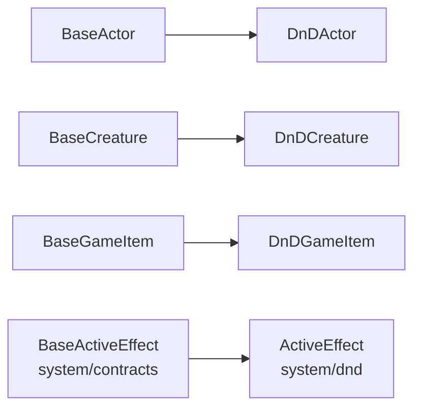
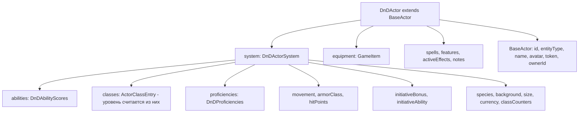

# D&D 5e System — Архитектура расчётов

Движок правил D&D 5e: типы, расчёты, боевой пайплайн, SRD-данные.
Живёт в `packages/shared/src/system/dnd/`, точка входа — `index.ts`.

## Границы: ядро не знает D&D

D&D-кластер **приватен для системы dnd5e**. Ядро (клиентское/серверное `core`,
сторы, сокеты, hooks, транспорт) работает только с нейтральными типами и с
контрактом `VttSystem` — про содержимое D&D-правил оно не знает ничего.

### Импорт только через субпуть

Кластер **не** реэкспортируется из корневого barrel `@vtt/shared`. Он доступен
отдельным экспортом в `packages/shared/package.json`:

```jsonc
"./system/dnd.js": {
  "types": "./src/system/dnd/index.ts",
  "default": "./dist/src/system/dnd/index.js"
}
```

Код системы импортит его так:

```ts
import { calculateWeaponAttackModifier, dnd5eSystemInstance } from '@vtt/shared/system/dnd.js';
```

### Нейтральное ↔ D&D-форма

| Слой | Где | Что знает |
|------|-----|-----------|
| Нейтральные типы | `types/index.ts`, `types/base.ts` | `BaseActor`, `BaseCreature`, `BaseGameItem`, `SceneEntity`, `CompendiumEntry`. Поле `system: Record<string, unknown>` — «чёрный ящик» |
| Нейтральные контракты | `system/contracts/**` | `BaseActiveEffect`, `EffectOrigin`, `EffectDuration`, `EffectAura` — кросс-катные VTT-концепты (зрение, ауры, состояния) |
| Контракт системы | `system/vttSystem.ts` | Интерфейс `VttSystem` — единственная дверь, через которую ядро зовёт правила |
| D&D-форма | `system/dnd/dndEntities.ts` | `DnDActor`, `DnDCreature`, `DnDGameItem`, `Spell` — сужения нейтральных баз |
| D&D-правила | остальной `system/dnd/**` | расчёты, эффекты, урон, отдых, SRD |

**`shared/types` развязан от `system/dnd`.** Из `types/index.ts` есть ровно один
импорт в сторону системы — нейтральный контракт
`system/contracts/activeEffect.js` (`BaseActiveEffect`). Ссылок на `system/dnd`
нет: `base.ts` — примитивный leaf, тянуть в него `system/dnd` нельзя (цикл).

### `dndEntities.ts` — D&D-сущности верхнего уровня

Определения `DnDActor`/`DnDCreature`/`DnDGameItem`/`Spell` **переехали сюда из
`types/index.ts`** — именно этот переезд и развязал ядро типов от движка правил.

Каждая сущность наследует нейтральную базу и добавляет D&D-форму:



Там же — deprecated-алиасы обратной совместимости:
`Actor = DnDActor`, `Creature = DnDCreature`, `GameItem = DnDGameItem`.
В новом коде: `DnD*` — для D&D-специфичного, `Base*` — для generic/core.

### Страж: `no-system-dnd-value-outside-systems`

Правило dependency-cruiser (`.dependency-cruiser.cjs`) — **severity: error**:

| Правило | Конфиг | Кому запрещено импортить `system/dnd` как ЗНАЧЕНИЕ |
|---------|--------|---------------------------------------------------|
| `no-system-dnd-value-outside-systems` | `.dependency-cruiser.cjs` | всему `packages/(server\|shared)/src/`, кроме `server/src/systems/**` и `shared/src/system/dnd/**` |
| `no-client-system-dnd-value-outside-systems` | `.dependency-cruiser.client.cjs` | всему `packages/client/src/`, кроме `client/src/systems/**` |
| `no-core-to-dnd` | `.dependency-cruiser.cjs` | `packages/(server\|client)/src/core/` — включая type-only |
| `no-module-to-dnd` | `.dependency-cruiser.cjs` | `packages/(client\|server)/src/modules/` — включая type-only |

Ключевые детали:

- **type-only импорты разрешены в §0.5-правилах** (`no-system-dnd-value-outside-systems`
  и `no-client-system-dnd-value-outside-systems` — у обоих
  `dependencyTypesNot: ['type-only', 'type-import']`): они стираются при сборке и
  не тянут движок в рантайм-бандл. У `no-core-to-dnd` и `no-module-to-dnd` этого
  исключения **нет** — они запрещают зависимость целиком, включая type-only.
- **Оба §0.5-правила** матчат **и голый спецификатор** `@vtt/shared/system/dnd`,
  **и резолв в исходники** `^packages/shared/src/system/dnd/` — без второго
  паттерна кросс-пакетные рёбра проходили бы мимо и правило было бы мёртвым.
  У `no-core-to-dnd` и `no-module-to-dnd` `to.path` задан только голым
  спецификатором `@vtt/shared/system/dnd`.
- Остальной код обязан ходить через контракт `VttSystem`
  (`systemRegistry.getSystem()` / `getActiveSystem()`).

Проверка: `pnpm arch:check` (клиент + сервер).

### Реализация контракта

`dnd5eSystem.ts` → `class Dnd5eVttSystem implements VttSystem` и синглтон
`dnd5eSystemInstance`. Это и есть D&D-движок, который клиентский код системы
регистрирует через `api.defineSystem(dnd5eSystemInstance)`.

---

## Структура данных Actor



### Поля в `system` (DnDActorSystem)

Всё, что определяется **правилами D&D 5e** (`types.ts`). Тип несёт
`[key: string]: unknown` — index signature для совместимости с
`BaseActor.system: Record<string, unknown>`.

| Поле | Тип | Описание |
|------|-----|----------|
| `abilities` | `DnDAbilityScores` | 6 характеристик (strength, dexterity, constitution, intelligence, wisdom, charisma) |
| `classes` | `ActorClassEntry[]` | Классы персонажа (массив — мультикласс). **Уровень отдельным полем не хранится** |
| `experience` | `number` | Опыт персонажа |
| `species` | `ActorSpeciesEntry \| null` | Вид (бывшая раса) + выборы особенностей |
| `background` | `ActorBackgroundEntry \| null` | Предыстория |
| `size` | `CreatureSize` | Размер (`tiny` … `gargantuan`) |
| `proficiencies` | `DnDProficiencies` | Владения: `armor`, `weapons`, `weaponMasteries`, `tools`, `languages`, `savingThrows`, `skills` |
| `movement` | `ActorMovement` | Типы движения (walk, swim, fly, climb, burrow, hover) + `units` |
| `armorClass` | `ActorArmorClass` | КД с формулой расчёта |
| `hitPoints` | `DnDHitPoints` | Хиты: `{ current, max, temp }` |
| `initiativeBonus` | `number` | Дополнительный бонус к инициативе |
| `initiativeAbility` | `AbilityType` | Характеристика для инициативы |
| `currency` | `DnDCurrency` | Валюта (`cp`, `sp`, `ep`, `gp`, `pp`) |
| `classCounters` | `ActorCounterState[]` | Счётчики классовых ресурсов (очки чародейства, кости превосходства) |
| `spellSlotsUsed` | `number[]?` | Использованные ячейки [1–9 круг], индекс 0 = 1-й круг |
| `pactSlotsUsed` | `number?` | Использованные ячейки Pact Magic (колдун) |
| `spellcastingAbility` | `AbilityType?` | Переопределение характеристики заклинаний |
| `inspiration` | `boolean?` | Вдохновение (даёт/забирает только ГМ) |
| `manualHitDice` | `ManualHitDieGroup[]?` | Ручные кости хитов (NPC/кастомные актёры без классов) |

> **Уровня `system.level` НЕТ.** Суммарный уровень вычисляется:
> `getTotalLevel(actor.system.classes)` (`classTypes.ts`) — сумма `entry.level`
> по всем классам, минимум 1.

### Поля на корне (DnDActor)

Привязаны к конкретному актору, не к правилам:

- **Добавляет `DnDActor`:** `spells`, `equipment`, `features`, `activeEffects`, `notes`
- **Наследует от `BaseActor`:** `id`, `entityType`, `name`, `description`, `avatar`, `token`, `ownerId`, `isPublic`, `autoSaves`, `system`

> **Хиты на корне отсутствуют.** `currentHitPoints`/`maxHitPoints`/`tempHitPoints`
> удалены — источник истины один: `system.hitPoints.{current,max,temp}`.
> Поле `effects` тоже удалено — актуальное имя `activeEffects: ActiveEffect[]`.

## Расчёт модификатора атаки

```
calculateWeaponAttackModifier(actor, weapon, resolvedStats?)
├─ abilityScore = resolveWeaponAbilityScore(actor, weapon)
│  ├─ if weapon.weaponProperties includes "finesse":
│  │  └─ max(abilities.strength, abilities.dexterity)   ← фехтовальное
│  └─ else: abilities[weapon.attackAbility ?? "strength"]
├─ modifier = calculateAbilityModifier(abilityScore)    ← floor((score - 10) / 2)
├─ if resolveWeaponProficiency(actor, weapon):
│  └─ modifier += calculateProficiencyBonus(getTotalLevel(actor.system.classes))
│                                                       ← floor((level - 1) / 4) + 2
├─ modifier += weapon.attackBonus
├─ if weapon.isMagical && weapon.magicBonus:
│  └─ modifier += weapon.magicBonus                     ← магический бонус
└─ if resolvedStats:                                    ← Active Effects (ауры, экипировка)
   └─ modifier += weapon.rangeType !== "ranged"
        ? resolvedStats.attackBonuses.melee
        : resolvedStats.attackBonuses.ranged
```

Реализация — `calculations.ts`.

### resolveWeaponProficiency

Проверяет три режима (`weapon.proficiencyMode ?? 'auto'`):

1. **always** — бонус всегда добавляется
2. **never** — бонус никогда не добавляется
3. **auto** — сверяет `weapon.baseType` и `weapon.weaponCategory` со списком
   `actor.system.proficiencies.weapons[]`. Без `baseType` → `false`

Профициенции хранятся **по английским ключам**:
- Конкретные: `"longsword"`, `"shortbow"`, `"handaxe"`
- Категории: `"simple"`, `"martial"`

## Критически важные поля для расчётов

| Расчёт | Поле актёра | Поле оружия |
|--------|-------------|-------------|
| Модификатор атаки | `system.abilities[attackAbility]` | `attackAbility`, `weaponProperties` (finesse) |
| Бонус мастерства | `system.classes` (через `getTotalLevel`) | `proficiencyMode` |
| Владение оружием | `system.proficiencies.weapons[]` | `baseType`, `weaponCategory` |
| Бонус к атаке | — | `attackBonus` |
| Магический бонус | — | `isMagical`, `magicBonus` |
| Бонусы от эффектов | `ResolvedActorStats.attackBonuses` | `rangeType` (melee/ranged) |

## Единицы измерения расстояния

Конфигурация единиц вынесена в `packages/shared/src/utils/unitConverter.ts`.

> Модуль **нейтральный** — лежит вне `system/dnd` и доступен из корневого barrel
> `@vtt/shared`. Им пользуются ядро и любая игровая система, не только D&D.

### Поддерживаемые единицы (`DistanceUnit`)

| Ключ | Название | Коэффициент к метрам |
|------|----------|---------------------|
| `ft` | Футы | 0.3048 |
| `m` | Метры | 1 |
| `mi` | Мили | 1609.344 |
| `km` | Километры | 1000 |

### API

- `convertDistance(value, fromUnit, toUnit)` — конвертация между единицами
- `formatDistance(value, unit)` — форматирование с локализованной меткой (`30 фт`)
- `isDistanceUnit(value)` — type guard
- `DISTANCE_UNIT_OPTIONS` — опции для `USelectMenu`
- `DISTANCE_UNIT_LABELS` — полные названия (`Футы (ft)`)
- `DISTANCE_UNIT_SHORT` — короткие метки (`фт`, `м`, `мили`, `км`)
- `CONVERSION_TO_METERS` — **редактируемый конфиг** коэффициентов

### Где используется

| Поле | Где объявлено | Слой |
|------|---------------|------|
| `Scene.gridSettings.units` | `types/base.ts` | нейтральное (default `ft`) |
| `ActorMovement.units` | `types/base.ts` | нейтральное |
| `DnDGameItem.distanceUnit` | `system/dnd/dndEntities.ts` | D&D-форма — reach/range оружия (default `ft`) |
| `CreatureAction.distanceUnit` | `system/dnd/creatureTypes.ts` | D&D-форма — досягаемость действия существа |
| `SystemManifest.defaultDistanceUnit` | `types/module.ts` | манифест системы (`'ft' \| 'm'`) — единица по умолчанию для системы |
